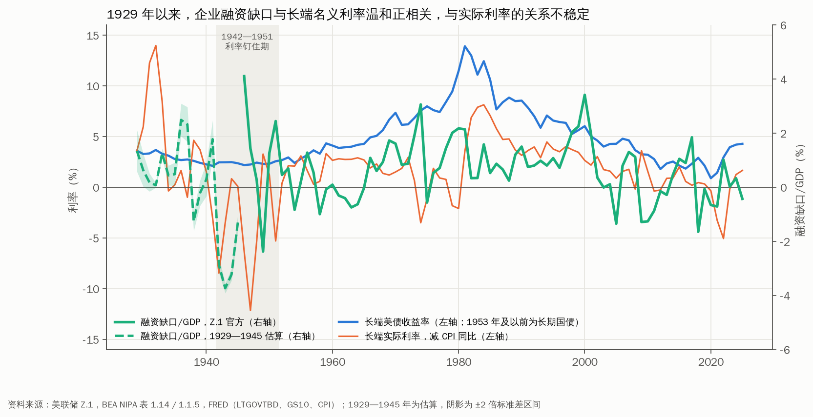

# 七、分析二：企业融资（尤其长久期发债）如何影响美债利率

> 数据截至 2026Q2（Z.1）/ 2026 年 9 月（日度利率）。复现：`python scripts/fetch_data.py && python scripts/analysis_financing.py`。完整数字见 [`output/financing_results.md`](output/financing_results.md)。

## 核心结论

**企业外部融资需求与实际利率同向，但当前企业部门整体仍在用内部资金覆盖资本开支。** 1985 年以来，非金融企业融资缺口/GDP 与 10 年期实际利率的相关系数为 0.47。2026Q2 融资缺口为 −1.10% GDP，内部资金/GDP 升至 11.03%，AI 资本开支尚未把企业部门整体推向外部融资。

**长久期发债对美债利率的“供给冲击”量级有限，季度数据中不可识别。** 公司债净发行对期限溢价的回归系数为负且统计上不成立，反映企业在利率低位时择时发债。14 笔单笔 150 亿美元以上的超大额发行，定价前后 7 个交易日 30 年期美债平均上行 5.1bp（t=1.49），9 笔为正，但均值落在 12.7bp 的正常波动区间内。

**企业债与美债的关系由“此消彼长”转为“同步扩张”。** 1952—1984 年美债/GDP 与企业债/GDP 的相关系数为 −0.38，与 Graham-Leary-Roberts（2015）的挤出证据一致；2008—2026 年转为 0.74，两者同受低利率与财政扩张驱动。

## 一、融资缺口：外部融资需求与实际利率同向

**1970—2000 年，企业资本开支长期超出内部资金，融资缺口多在 1—3% GDP。** 参考美联储 Z.1 表 S.11.1，融资缺口/GDP 在 1970 年为 1.77%、1980 年为 2.27%、2000 年升至 2.99%，同期 10 年期实际利率多处 2—4.5%。

| 年份 | 资本开支/GDP | 内部资金/GDP | 融资缺口/GDP | 公司债净发行/GDP | 美债净发行/GDP | 10Y 实际利率 |
|---|---:|---:|---:|---:|---:|---:|
| 1970 | 9.15 | 7.38 | 1.77 | 1.49 | 0.89 | 2.67 |
| 1980 | 10.86 | 8.59 | 2.27 | 0.90 | 2.71 | 2.28 |
| 1999 | 10.86 | 8.81 | 2.05 | 2.17 | −1.02 | 4.32 |
| 2000 | 11.16 | 8.18 | 2.99 | 1.63 | −1.96 | 4.24 |
| 2006 | 9.67 | 10.16 | −0.48 | 0.26 | 1.57 | 2.40 |
| 2010 | 8.12 | 9.58 | −1.45 | 1.11 | 10.24 | 1.76 |
| 2019 | 10.36 | 10.66 | −0.31 | 1.33 | 4.79 | 0.50 |
| 2024 | 10.18 | 9.88 | 0.30 | 0.88 | 7.44 | 1.26 |
| 2025 | 10.08 | 10.19 | −0.11 | 0.83 | 5.92 | 1.48 |
| 2026Q2 | 9.93 | 11.03 | −1.10 | 1.14 | 7.49 | 1.04 |

注：单位 %；四季度移动平均后取年均，2026Q2 为单季读数。

**2004 年以来，企业内部资金多数年份覆盖资本开支，“企业储蓄过剩”延续近二十年。** 融资缺口在 2004—2010 年、2019—2021 年、2025—2026 年均为负值，这一时期 10 年期实际利率由 2% 以上降至 2020—2022 年的负值区间。1985 年以来，融资缺口与 10 年期实际利率、名义利率、ACM 期限溢价的相关系数分别为 0.47、0.42、0.21。

**AI 资本开支集中在少数现金充裕的超大型科技公司，尚未改变企业部门整体的资金盈余格局。** 2026Q2 资本开支/GDP 为 9.93%，低于 2000 年的 11.16%；内部资金/GDP 为 11.03%，处于历史高位。这意味着，AI 融资对利率的影响或更多通过个别发行人的长久期发行与表外结构体现，总量层面的“借款回摆”尚未出现。

**1999—2000 年是“缺口填补”的典型样本。** 财政盈余使美债净发行转负（−1.02%、−1.96% GDP），同期公司债净发行升至 2.17%、1.63% GDP。企业长债填补了美债久期供给的空缺，与 Greenwood-Hanson-Stein（2010）的机制一致。

## 一（续）、长序列：把融资缺口延伸至 1929 年

**美联储 Z.1 的融资缺口官方数据始于 1946 年，1929—1945 年以 BEA 国民账户估算补齐。** 内部资金取 NIPA 表 1.14 非金融企业固定资本消耗与含 IVA、CCAdj 的未分配利润之和，1946 年后与 Z.1 口径几乎完全一致（1955 年 NIPA 为 331.21 亿美元，Z.1 为 331.31 亿美元）；资本开支取私人非住宅固定投资与非农存货变动之和的 69.9%，该比例为 1946—1965 年 Z.1 实际值的均值（标准差 3.0 个点）。

**估算方法在重叠期可靠。** 1946—1965 年，估算值与 Z.1 官方值的相关系数为 0.98，平均绝对误差 0.22 个点 GDP；图中阴影为比例取均值 ±2 倍标准差时的区间。

**1929—1945 年，企业融资缺口随大萧条与战争剧烈波动。** 1936—1937 年复苏期缺口升至 2.49%、2.33% GDP，1942—1944 年战时管制压缩民间投资，缺口降至 −2.87% 至 −3.73% GDP，1946 年战后重建期升至 4.11%，为 1929 年以来最高值。

| 样本 | 融资缺口 vs 长端名义利率 | 融资缺口 vs 长端实际利率 | 年数 |
|---|---:|---:|---:|
| 1929—1941 | −0.05 | −0.41 | 13 |
| 1946—1984 | 0.29 | −0.42 | 39 |
| 1985—2025 | 0.39 | 0.29 | 41 |
| 1929—2025（剔除 1942—1951 年） | 0.38 | −0.07 | 87 |

注：年度水平相关；1953 年及以前长端利率为长期国债收益率，此后为 10 年期美债；实际利率为长端收益率减 CPI 同比。

**拉长至近百年，融资缺口与长端名义利率温和正相关（0.38），与实际利率的关系随时期变化。** 1929—1941 年长端收益率在 2.1—3.7% 区间窄幅波动，与融资缺口基本无关；1930 年代初通缩使实际利率升至 12—14%，1946—1948 年战后通胀使其降至 −12% 附近，价格冲击主导了实际利率。1942—1951 年美联储钉住国债收益率，长端利率失去市场定价含义，计算相关时予以剔除。

**1985 年以来是融资缺口与实际利率同向关系唯一成立的阶段。** 年度数据下，1985—2025 年相关系数为 0.29，与季度数据的 0.47 方向一致；此前两个阶段均为负值。这意味着，“企业外部融资需求推升实际利率”的关系在通胀预期锚定之后才较为清晰，长历史并不支持将其视为稳定规律。

## 二、流量回归：长久期发债的供给效应不可识别

**控制政策利率与通胀变化后，公司债净发行对期限溢价的系数为 −13.5bp（t=−1.10），美债净发行为 −0.3bp（t=−0.15）。** 两者均未体现“净供给增加推升期限溢价”的关系。1962—1999 年子样本中，公司债净发行对期限溢价的系数为 −41.1bp（t=−2.46），负向关系更强。

**负系数主要反映发行择时，供给效应被反向因果掩盖。** 企业在长端利率与期限溢价偏低时集中发行长债，流量与利率的相关同时包含“供给推升利率”和“低利率诱发发行”两个方向，后者在季度数据中占优。识别供给效应需要借助发行日这类外生时点。

**美债净发行对期限溢价的系数接近零，说明季度流量口径本身存在局限。** Greenwood-Vayanos（2014）使用久期加权的美债存量识别出期限溢价效应，流量/GDP 口径未包含久期信息。下一步需补齐企业债发行的期限结构，构造久期加权供给。

## 三、存量关系：由“此消彼长”转为“同步扩张”

**1952—1984 年，美债/GDP 由 46.0% 降至 1974 年的 16.1%，企业债/GDP 由 11.4% 升至 1971 年的 15.7%，两者水平相关系数为 −0.38。** 这一时期政府去杠杆为企业债让出空间，与 Graham-Leary-Roberts（2015）百年样本中的挤出关系方向一致。

| 样本 | 公司债/GDP vs 美债/GDP（水平相关） | Δ4 公司债/GDP 对 Δ4 美债/GDP（回归系数） |
|---|---:|---|
| 1952—1984 | −0.38 | 0.053* |
| 1985—2007 | −0.33 | −0.027 |
| 2008—2026 | 0.74 | 0.213*** |

**2008 年以来两者同步扩张，美债/GDP 每上升 1 个点，公司债/GDP 同期上升 0.21 个点。** 低利率与量化宽松同时降低了政府与企业的融资成本，挤出效应让位于共同的利率驱动。2026Q2，美债/GDP 为 95.05%，企业债/GDP 为 25.48%，企业债存量为美债的 26.8%，企业久期供给对美债定价的边际影响受此约束。

**公司债占非金融企业债务的比重由 1984 年的 38.2% 升至 2017 年的 64.7%，此后回落至 2026Q2 的 55.9%。** 近年回落与私募信贷等贷款类融资扩张同步，部分长久期融资需求转向表外与私募市场，公开债券数据或低估企业的真实久期供给。

## 四、避险：信用利差走阔时美债收益率倾向下行

**1953 年以来，10 年期美债收益率月度变化与 Baa−Aaa 信用利差变化的相关系数为 −0.32。** 企业信用恶化时，资金流向美债，压低美债收益率。采用 Baa−Aaa 利差，可避免 Baa−10Y 利差与 10Y 之间的机械负相关。

**避险关系的强度随时期变化，在 1974—1983 年（−0.51 至 −0.57）与 2009—2013 年（−0.37）较强，截至 2026 年 8 月的 60 个月滚动相关转为 0.14。** 近年通胀与财政主导美债定价，信用利差与美债收益率同向波动的时段增多，美债对企业信用风险的对冲作用有所弱化。

## 五、事件研究：超大额发行对 30 年期美债的冲击有限

**14 笔单笔 150 亿美元以上的企业发行中，定价日前 3 至后 3 个交易日，30 年期美债收益率平均上行 5.1bp（t=1.49），10 年期平均上行 4.1bp（t=1.15），30Y−10Y 利差平均变化 0.9bp（t=0.70）。** 同期 2010 年以来全部 7 日窗口的 30 年期收益率变化均值为 0.1bp，标准差 12.7bp。方向偏正，但统计上不成立。

**4 笔窗口变化超过 1 倍标准差：Actavis（2015 年 3 月，+27bp）、Boeing（2020 年 4 月，+15bp）、Pfizer（2023 年 5 月，+15bp）、Alphabet（2025 年 11 月，+14bp）。** 这些窗口同时叠加了宏观数据与美联储沟通，难以归因于单笔发行。

**2025 年 9—11 月四笔 AI 相关发行（Oracle、Meta、Alphabet、Amazon）窗口内 30 年期收益率平均上行 5.8bp，3 笔为正。** 与历史大额发行的平均反应接近，AI 发行尚未表现出更强的长端冲击。样本较小，且发行日期来自公开报道整理，需逐笔核验。

## 六、小结与待办

**企业融资影响美债利率的三条渠道，历史证据强弱不一：** 一是外部融资需求渠道，融资缺口与实际利率同向（0.47），证据较强；二是久期供给渠道，季度流量回归与事件研究均未识别出统计上成立的推升效应，量级或在数个 bp 以内；三是避险渠道，信用利差与美债收益率长期负相关，但近年减弱。

**对当前的判断：** AI 融资目前集中在个别发行人，企业部门整体仍有资金盈余，“企业由储蓄者转为借款者”的判断在总量数据中尚未成立，构思阶段的这一假说需要下调。若后续融资缺口转正并持续扩大至 1% GDP 以上，才构成对美债实际利率的系统性上行压力。

待办：
1. 补齐企业债发行的期限结构（SIFMA / FINRA TRACE），构造久期加权的企业债与美债供给，复现 Greenwood-Vayanos 框架。
2. 扩大事件样本至单笔 100 亿美元以上，加入 30 年期 SOFR 互换利差作为因变量，并逐笔核验定价日期。
3. 单独统计超大型科技公司的资本开支、经营现金流与发债，检验总量数据之外的结构性融资缺口。
4. 纳入表外融资（合资 SPV、私募信贷），估计公开数据的低估程度。
