# 企业投资会抬升美债利率吗？
——企业投资、长久期融资与美债利率的历史复盘

## 摘要

2000 年代以来，美国企业部门长期处于资金盈余状态，企业储蓄是长端利率低位运行的因素之一。2025 年起，超大型科技公司为 AI 资本开支集中发行长久期债券，市场开始讨论企业部门是否会成为美债利率的新推升力量。但历史上企业投资与融资对美债的影响，渠道与量级差异较大。企业投资通过哪条渠道影响美债？长久期发债能否与美债争夺久期买盘？本轮 AI 周期与历史相比有何不同？

**投资对美债利率的影响主要借道政策利率。** 实际非住宅投资同比每上升 1 个点，联邦基金利率四季度变化上行 16.1bp，10 年期美债上行 4.1bp；10 年期的上行全部来自预期短端利率（+6.8bp），期限溢价反向下行 3.6bp。

**有形投资与利率的联动强于投资总量，但 2008 年后同样减弱。** 建筑与设备投资/GDP 与 10 年期名义利率的全样本水平相关系数为 0.79，1953—1984 年为 0.88，2008—2026 年转为 −0.13；知识产权产品投资与利率变化基本无关。

**“资本开支增速与债券收益率高度同步”的图表，主要反映名义增长。** 以美国数据复现，1986—2026 年名义资本开支 5 年年化增速与 10 年期美债的相关系数为 0.21，剔除价格后为 0.11，名义 GDP 增速为 0.76。

**企业外部融资需求与实际利率同向，但企业部门整体仍在用内部资金覆盖资本开支。** 1985 年以来融资缺口/GDP 与 10 年期实际利率的相关系数为 0.47；2026Q2 融资缺口为 −1.10% GDP，AI 融资尚未改变总量格局。

**长久期发债的供给冲击量级有限。** 14 笔单笔 150 亿美元以上的企业发行，定价前后 7 个交易日 30 年期美债平均上行 5.1bp（t=1.49），落在 12.7bp 的正常波动区间内。

**2022 年以来的投资上行期，是 1982 年以来首次期限溢价同步抬升的一轮。** 本轮期限溢价上行 139bp，贡献了 10 年期上行 248bp 中的一半以上；有形投资/GDP 为 8.47%，仍低于 2019 年，AI 资本开支若推动有形投资回升，名义利率的上行压力或重新显现。

# 一、企业投资与美债利率

## （一）长周期：投资上行期多伴随利率上行，但方向并不稳定

**图1：投资上行期多伴随利率上行，但 2010 年后的投资扩张未能扭转利率下行趋势**

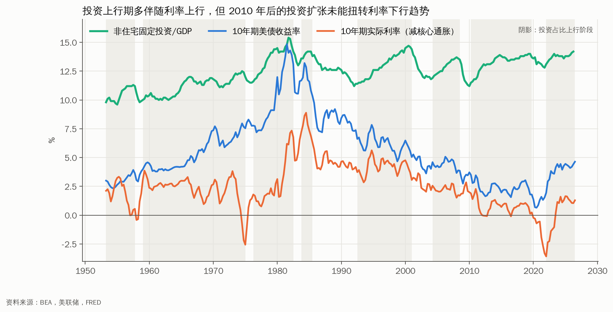

**1953 年以来共识别出 8 轮投资上行期，其中 4 轮 10 年期收益率上行、4 轮下行。** 以非住宅固定投资/GDP 四季度均值的拐点划分（阈值 0.8 个点），1953—1957 年、1959—1974 年、1976—1982 年、2022—2026 年四轮期间 10 年期收益率分别上行 93bp、368bp、616bp、248bp；1983—1985 年、1992—2000 年、2004—2008 年、2010—2019 年四轮期间分别下行 87bp、105bp、71bp、169bp。

| 投资上行期 | 投资/GDP 变化(个点) | 10Y(bp) | 联邦基金利率(bp) | 预期短端利率(bp) | 期限溢价(bp) |
|---|---:|---:|---:|---:|---:|
| 1953Q2—1957Q3 | 1.8 | 93 | — | — | — |
| 1959Q1—1974Q4 | 2.4 | 368 | 678 | 238 | 96 |
| 1976Q2—1982Q2 | 3.5 | 616 | 932 | 371 | 190 |
| 1983Q4—1985Q2 | 0.9 | −87 | −151 | −82 | −4 |
| 1992Q3—2000Q4 | 3.2 | −105 | 322 | 155 | −306 |
| 2004Q2—2008Q2 | 1.7 | −71 | 108 | 8 | −72 |
| 2010Q2—2019Q3 | 2.6 | −169 | 200 | 130 | −317 |
| 2022Q1—2026Q2 | 1.0 | 248 | 351 | 106 | 139 |

注：ACM 分解始于 1961Q3，1959—1974 年一段以 1961Q3 为起点。

**有数据的 7 轮投资上行期中，政策利率 6 轮同步上行，是投资周期最稳定的利率映射。** 唯一的例外是 1983—1985 年，彼时沃尔克紧缩后的降息周期压过了投资回升。这意味着，投资扩张对利率的推动首先体现在美联储反应函数上。

**图2：投资上行期预期短端利率普遍抬升，期限溢价方向不定**

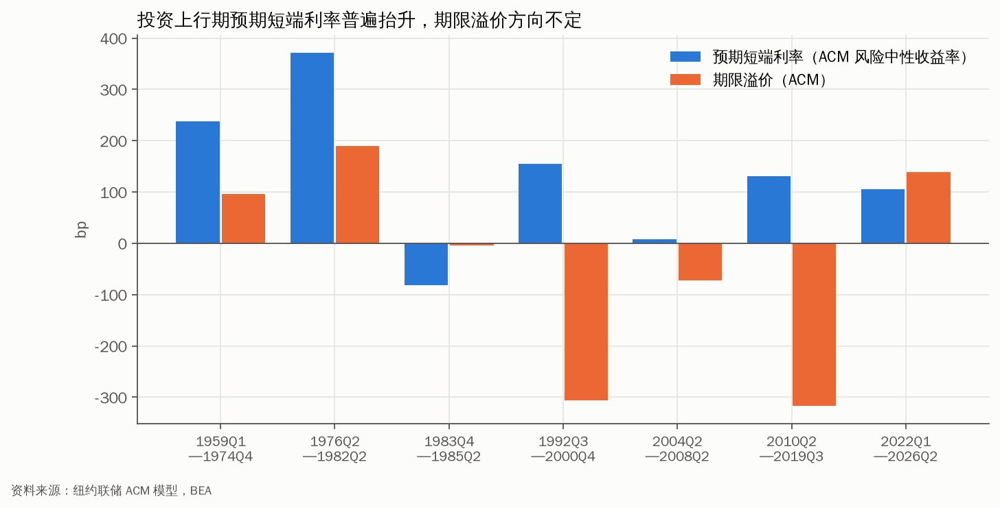

**期限溢价决定了投资上行期长端利率的最终方向。** 7 轮可分解的投资上行期中，预期短端利率 6 轮上行；期限溢价 3 轮上行、4 轮下行。1992—2000 年、2010—2019 年两轮投资扩张期，期限溢价分别下行 306bp 和 317bp，完全抵消了预期短端利率的上行。两轮下行或与通胀预期回落、全球储蓄过剩（参考伯南克 2005 年演讲）有关，投资需求未能扭转这些力量。

## （二）回归：投资提速推升政策利率，对期限溢价的作用为负

**图3：投资提速主要推升政策利率，对期限溢价的影响为负**

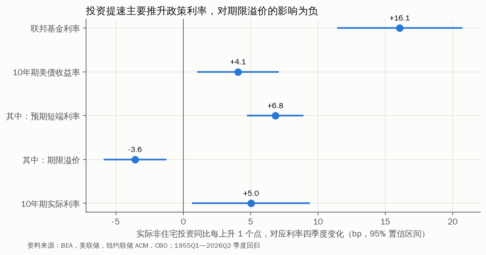

**控制通胀和失业率缺口后，投资增速对政策利率的解释力最强。** 以实际非住宅投资同比为解释变量、利率四季度变化为因变量（1955—2026 年季度，Newey-West 标准误），联邦基金利率系数 16.1bp（t=6.76），10 年期收益率 4.1bp（t=2.62），预期短端利率 6.8bp（t=6.41），期限溢价 −3.6bp（t=−3.01），10 年期实际利率 5.0bp（t=2.25）。

| 实际非住宅投资同比 +1 个点 | 全样本 | 1962—1984 | 1985—2007 | 2008—2026 |
|---|---|---|---|---|
| 联邦基金利率 | 16.1*** | 22.4*** | 14.6*** | 12.3*** |
| 10 年期美债收益率 | 4.1*** | 5.9** | 3.3 | 1.2 |
| 其中：预期短端利率 | 6.8*** | 7.1*** | 7.9*** | 4.2*** |
| 其中：期限溢价 | −3.6*** | −2.0 | −5.8*** | −4.2** |
| 10 年期实际利率 | 5.0** | 11.1*** | 3.3 | −4.5** |

注：单位 bp；***、**、* 分别表示 1%、5%、10% 水平下成立。

**期限溢价对投资增速的负向反应，或反映“增长确定性”对风险补偿的压缩。** 投资提速通常出现在经济扩张中段，此时衰退概率下降、利率波动率回落，投资者要求的久期补偿随之收窄。这意味着，投资需求本身未必挤压长久期资金，其对长端的推升需要依靠政策利率路径来完成。

**2008 年以来，投资增速对 10 年期实际利率的系数转为负值（−4.5bp）。** 这一阶段投资回升多发生在量化宽松与低通胀环境下，实际利率受央行资产负债表主导。样本中 2020—2022 年的疫情冲击或放大了这一负向关系，结论的稳健性有待进一步检验。

## （三）领先滞后：投资与政策利率同步，期限溢价约滞后 1.5 年转正

**图4：投资增速与政策利率同步变化，对长端利率的领先性较弱**

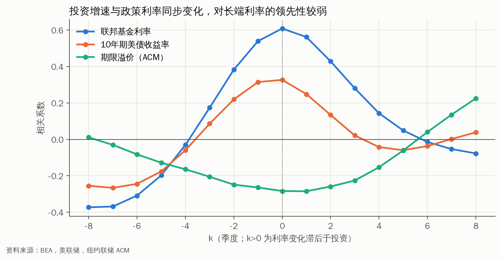

**投资增速与联邦基金利率变化的相关性在同期达到峰值（0.61），与 10 年期收益率变化的同期相关为 0.33。** 投资对利率的领先性有限，两者更多是对同一轮经济扩张的同步反应。

**期限溢价在同期与投资增速负相关（−0.28），滞后 6 个季度后转为正相关，滞后 8 个季度升至 0.22。** 投资扩张的后半程，产能约束与通胀压力开始积累，期限溢价或随之抬升。这一时滞与 2022 年以来“投资先行、期限溢价后升”的路径大体吻合。

## （四）结构：无形资产投资上升与中性利率下行同步

**图5：投资结构转向无形资产的同时，中性利率趋势下行**

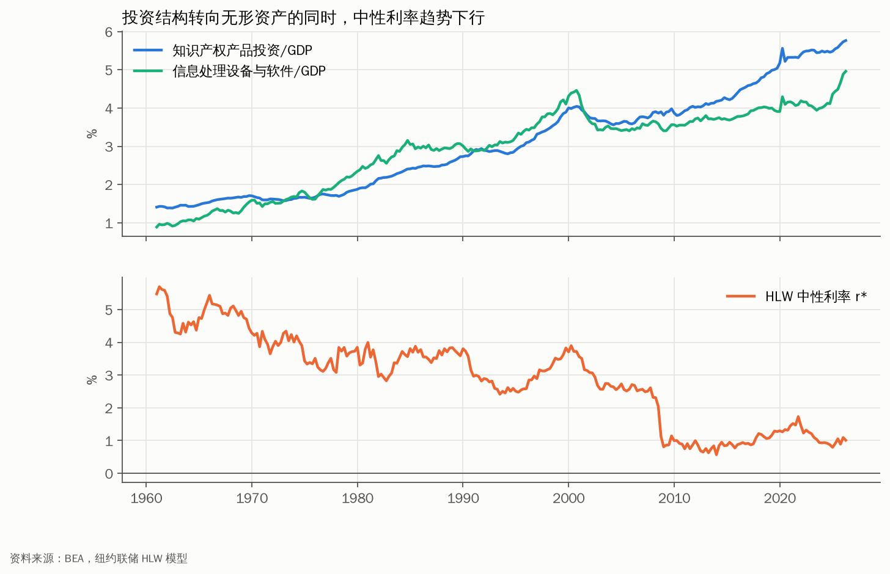

**1961 年以来，知识产权产品投资/GDP 与 HLW 中性利率的相关系数为 −0.86，信息处理设备与软件投资/GDP 为 −0.80；非住宅投资总量/GDP 仅为 −0.42。** 投资结构转向“轻资产”，单位产出所需的外部资金减少，投资占比的上升未能转化为对可贷资金的等量需求。水平序列存在共同趋势，这一相关仅作描述。

**2026Q2，知识产权产品投资/GDP 为 5.76%，信息处理设备与软件为 4.96%，均处历史高位；同期 HLW r\* 为 1.01%。** AI 资本开支包含大量数据中心、电力设备等“重资产”成分，若延续，投资结构或出现 1990 年代以来的首次“再重资产化”，中性利率的下行趋势或面临修正。这一判断需要结合分项投资数据单独检验。

## （五）有形投资：与利率的联动强于投资总量

**图6：有形投资与名义利率长期同向，2008 年后联动减弱**

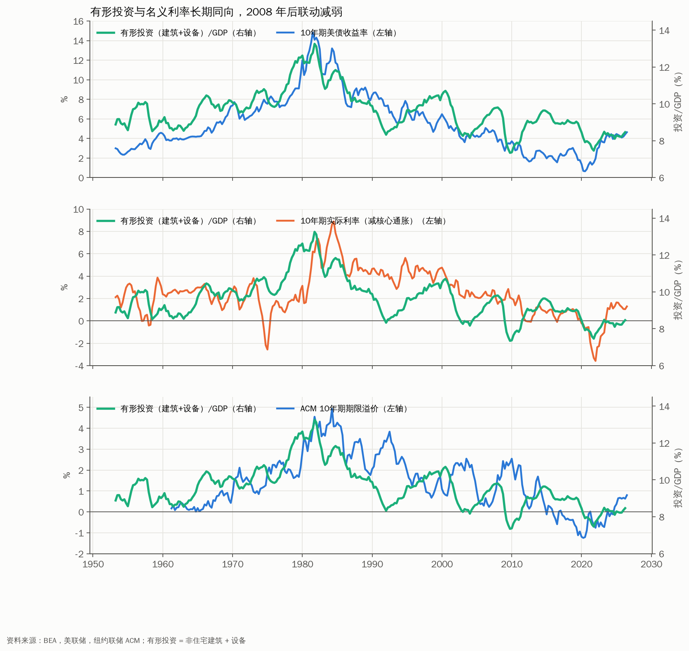

**剔除知识产权产品后，有形投资（建筑+设备）/GDP 与 10 年期名义利率的全样本水平相关系数为 0.79，四季度变化相关系数为 0.40；同期（1953Q2—2026Q2）投资总量的对应水平相关仅为 0.30。** 知识产权产品投资与各项利率的四季度变化相关均在 ±0.3 以内，投资总量与利率联动的减弱，一部分来自投资结构向无形资产倾斜。

| 有形投资/GDP 与… | 1953—1984 | 1985—2007 | 2008—2026 | 全样本 |
|---|---:|---:|---:|---:|
| 10 年期名义利率（水平） | 0.88 | 0.55 | −0.13 | 0.79 |
| 10 年期名义利率（四季度变化） | 0.54 | 0.31 | 0.15 | 0.40 |
| 10 年期实际利率（水平） | 0.36 | 0.65 | 0.24 | 0.49 |
| 10 年期实际利率（四季度变化） | 0.14 | 0.25 | 0.02 | 0.15 |
| ACM 期限溢价（水平） | 0.75 | 0.02 | −0.07 | 0.51 |
| ACM 期限溢价（四季度变化） | −0.15 | −0.38 | −0.32 | −0.24 |
| 联邦基金利率（四季度变化） | 0.65 | 0.70 | 0.48 | 0.62 |

**名义利率：2008 年前同向，2008 年后联动基本消失。** 有形投资与 10 年期名义利率的水平相关由 1953—1984 年的 0.88 降至 1985—2007 年的 0.55，2008—2026 年转为 −0.13。2010—2019 年有形投资/GDP 最高回升至 9.64%，2012—2019 年 10 年期收益率始终处于 1.56—3.03% 的区间，量化宽松与低通胀主导了这一阶段的长端定价。

**实际利率：1985—2007 年联动最强（0.65），通胀因素剔除后投资与资金价格的关系更清晰。** 1953—1984 年实际利率受 1970 年代通胀冲击扭曲，水平相关仅 0.36；四季度变化层面，各时期相关均在 0.25 以下，投资对实际利率的影响以趋势为主、短期波动为辅。

**期限溢价：水平上 1984 年前同向，变化上各时期均为负相关。** 1953—1984 年水平相关 0.75，主要由 1970 年代末投资高峰与通胀风险溢价同时见顶驱动；四季度变化相关在各时期均为负（−0.15 至 −0.38），与前文回归结论一致：有形投资加速时，期限溢价倾向收窄。

**图7：2008 年前有形投资与名义利率正相关，2008 年后关系消失**

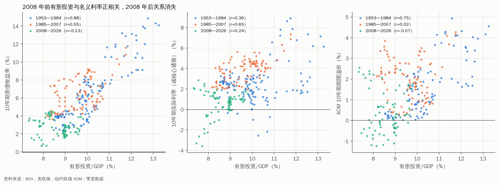

**2026Q2，有形投资/GDP 为 8.47%（建筑 2.73%，设备 5.74%），低于 2019Q3 的 8.95%，距 1981Q4 的 13.26% 仍有 4.8 个点。** AI 资本开支尚未在有形投资总量上形成可见的扩张，本轮非住宅投资占比的上升主要来自知识产权产品（5.76%，历史高位）。若数据中心与电力设备投资延续，有形投资占比回升，历史上与之同步的名义利率上行压力或重新显现。

## （六）稳健性：“资本开支增速 vs 债券收益率”图表的美国复现

**图8：剔除通胀后，资本开支增速与美债收益率的同步性基本消失**

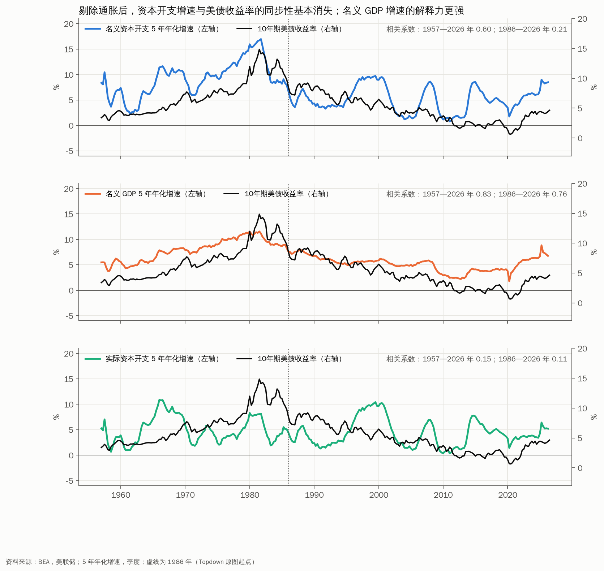

**参照 Topdown Charts “Global Capex vs Bond Yields” 的口径（资本开支 5 年年化增速对照 10 年期国债收益率水平），以美国非住宅固定投资复现：1986—2026 年名义资本开支增速与 10 年期美债的相关系数为 0.21，同期名义 GDP 增速为 0.76。** 原图两条线的高度重合，主要来自名义增长与通胀同时驱动资本开支增速和债券收益率。

| 与 10 年期美债收益率（水平）的相关系数 | 1957—2026 | 1986—2026 | 1986—2007 | 2008—2026 |
|---|---:|---:|---:|---:|
| 名义资本开支 5 年年化增速 | 0.60 | 0.21 | 0.12 | 0.41 |
| 实际资本开支 5 年年化增速 | 0.15 | 0.11 | −0.11 | 0.11 |
| 名义 GDP 5 年年化增速 | 0.83 | 0.76 | 0.80 | 0.64 |
| 资本开支增速超出名义 GDP 的部分 | 0.15 | −0.25 | −0.15 | 0.00 |

**剔除价格因素后，实际资本开支增速与 10 年期美债的相关系数降至 0.11—0.15，1986—2007 年为 −0.11。** 1995Q1—1999Q3 实际资本开支 5 年年化增速由 4.1% 升至 10.4%，同期 10 年期美债由 7.48% 回落至 5.88%，是二者背离最清晰的一段。

**资本开支增速超出名义 GDP 增速的部分，与 10 年期美债基本无关（−0.25 至 0.15）。** 资本开支相对经济整体“多出来”的扩张，历史上未能对应更高的收益率，这与前文“投资经由政策利率与名义增长传导”的结论一致。

**图9：与美债收益率同步的主要是名义增长，资本开支本身的解释力有限**

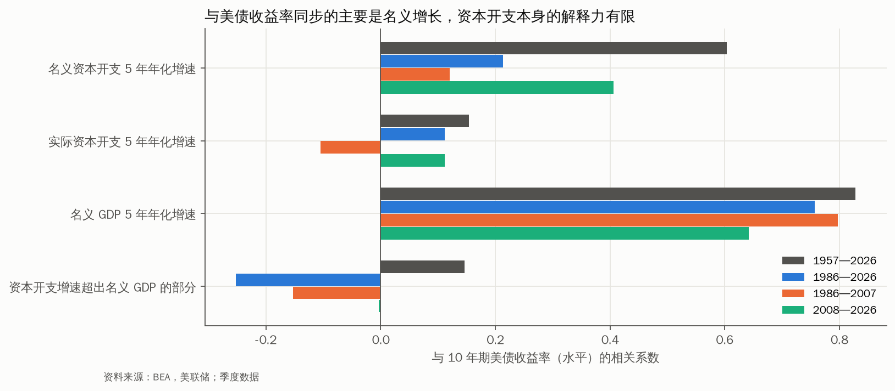

**当前读数同样受基数与通胀抬升。** 2026Q2 名义资本开支 5 年年化增速为 8.5%，实际为 5.2%，名义 GDP 为 6.8%；2021Q1 三者分别为 3.8%、3.3%、4.1%。5 年窗口的起点落在 2020—2021 年疫情低谷，叠加 2021—2023 年通胀，名义增速的回升中相当部分来自基数与价格。这类图表可用于描述趋势，作为“资本开支推升利率”的因果证据并不充分。

# 二、企业融资与美债利率

## （一）融资缺口：外部融资需求与实际利率同向

**图10：2000 年代以来企业内部资金多数时间覆盖资本开支，外部融资需求收缩**

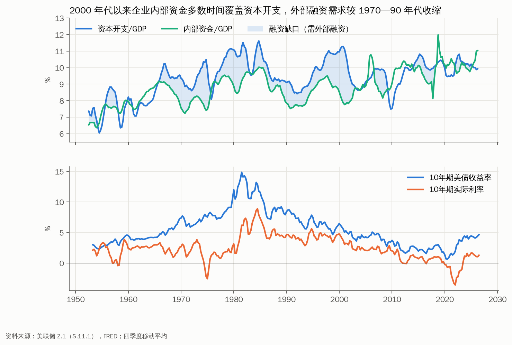

**1970—2000 年，企业资本开支长期超出内部资金，融资缺口多在 1—3% GDP。** 参考美联储 Z.1 表 S.11.1，融资缺口/GDP 在 1970 年为 1.77%、1980 年为 2.27%、2000 年升至 2.99%，同期 10 年期实际利率多处 2—4.5%。

| 年份 | 资本开支/GDP | 内部资金/GDP | 融资缺口/GDP | 公司债净发行/GDP | 美债净发行/GDP | 10Y 实际利率 |
|---|---:|---:|---:|---:|---:|---:|
| 1970 | 9.15 | 7.38 | 1.77 | 1.49 | 0.89 | 2.67 |
| 1980 | 10.86 | 8.59 | 2.27 | 0.90 | 2.71 | 2.28 |
| 1999 | 10.86 | 8.81 | 2.05 | 2.17 | −1.02 | 4.32 |
| 2000 | 11.16 | 8.18 | 2.99 | 1.63 | −1.96 | 4.24 |
| 2006 | 9.67 | 10.16 | −0.48 | 0.26 | 1.57 | 2.40 |
| 2010 | 8.12 | 9.58 | −1.45 | 1.11 | 10.24 | 1.76 |
| 2019 | 10.36 | 10.66 | −0.31 | 1.33 | 4.79 | 0.50 |
| 2024 | 10.18 | 9.88 | 0.30 | 0.88 | 7.44 | 1.26 |
| 2025 | 10.08 | 10.19 | −0.11 | 0.83 | 5.92 | 1.48 |
| 2026Q2 | 9.93 | 11.03 | −1.10 | 1.14 | 7.49 | 1.04 |

注：单位 %；四季度移动平均后取年均，2026Q2 为单季读数。

**2004 年以来，企业内部资金多数年份覆盖资本开支，“企业储蓄过剩”延续近二十年。** 融资缺口在 2004—2010 年、2019—2021 年、2025—2026 年均为负值，这一时期 10 年期实际利率由 2% 以上降至 2020—2022 年的负值区间。1985 年以来，融资缺口与 10 年期实际利率、名义利率、ACM 期限溢价的相关系数分别为 0.47、0.42、0.21。

**AI 资本开支集中在少数现金充裕的超大型科技公司，尚未改变企业部门整体的资金盈余格局。** 2026Q2 资本开支/GDP 为 9.93%，低于 2000 年的 11.16%；内部资金/GDP 为 11.03%，处于历史高位。这意味着，AI 融资对利率的影响或更多通过个别发行人的长久期发行与表外结构体现，总量层面的“借款回摆”尚未出现。

**1999—2000 年是“缺口填补”的典型样本。** 财政盈余使美债净发行转负（−1.02%、−1.96% GDP），同期公司债净发行升至 2.17%、1.63% GDP。企业长债填补了美债久期供给的空缺，与 Greenwood-Hanson-Stein（2010）的机制一致。

## （二）流量回归：长久期发债的供给效应不可识别

**图11：季度流量数据中，公司债净发行对长端利率的推升效应不可识别**

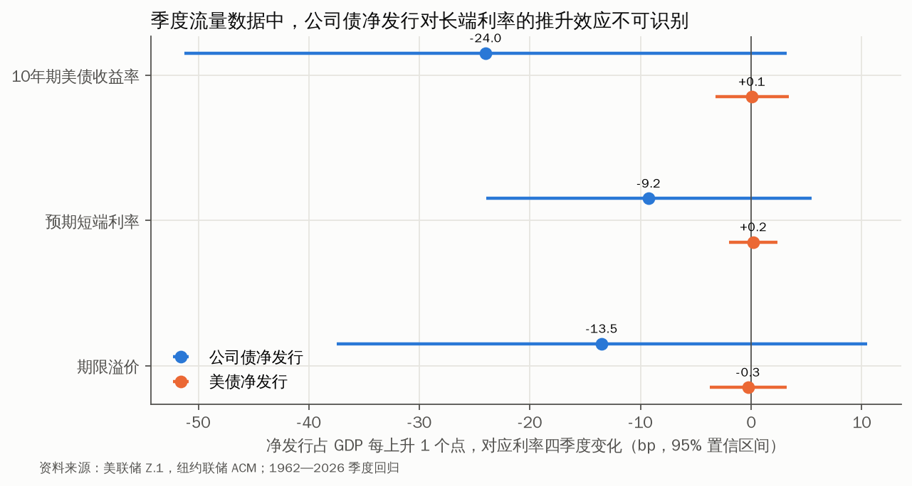

**控制政策利率与通胀变化后，公司债净发行对期限溢价的系数为 −13.5bp（t=−1.10），美债净发行为 −0.3bp（t=−0.15）。** 两者均未体现“净供给增加推升期限溢价”的关系。1962—1999 年子样本中，公司债净发行对期限溢价的系数为 −41.1bp（t=−2.46），负向关系更强。

**负系数主要反映发行择时，供给效应被反向因果掩盖。** 企业在长端利率与期限溢价偏低时集中发行长债，流量与利率的相关同时包含“供给推升利率”和“低利率诱发发行”两个方向，后者在季度数据中占优。识别供给效应需要借助发行日这类外生时点。

**美债净发行对期限溢价的系数接近零，说明季度流量口径本身存在局限。** Greenwood-Vayanos（2014）使用久期加权的美债存量识别出期限溢价效应，流量/GDP 口径未包含久期信息。下一步需补齐企业债发行的期限结构，构造久期加权供给。

## （三）存量关系：由“此消彼长”转为“同步扩张”

**图12：1952—1984 年美债/GDP 持续下行，2008 年后美债与企业债同步扩张**

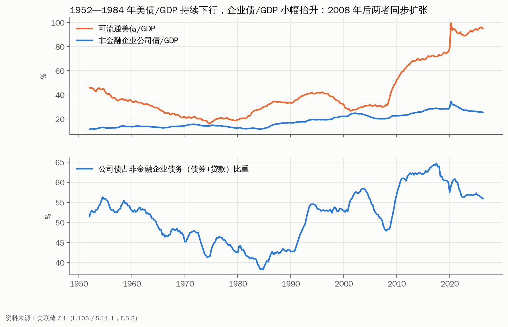

**1952—1984 年，美债/GDP 由 46.0% 降至 1974 年的 16.1%，企业债/GDP 由 11.4% 升至 1971 年的 15.7%，两者水平相关系数为 −0.38。** 这一时期政府去杠杆为企业债让出空间，与 Graham-Leary-Roberts（2015）百年样本中的挤出关系方向一致。

| 样本 | 公司债/GDP vs 美债/GDP（水平相关） | Δ4 公司债/GDP 对 Δ4 美债/GDP（回归系数） |
|---|---:|---|
| 1952—1984 | −0.38 | 0.053* |
| 1985—2007 | −0.33 | −0.027 |
| 2008—2026 | 0.74 | 0.213*** |

**2008 年以来两者同步扩张，美债/GDP 每上升 1 个点，公司债/GDP 同期上升 0.21 个点。** 低利率与量化宽松同时降低了政府与企业的融资成本，挤出效应让位于共同的利率驱动。2026Q2，美债/GDP 为 95.05%，企业债/GDP 为 25.48%，企业债存量为美债的 26.8%，企业久期供给对美债定价的边际影响受此约束。

**公司债占非金融企业债务的比重由 1984 年的 38.2% 升至 2017 年的 64.7%，此后回落至 2026Q2 的 55.9%。** 近年回落与私募信贷等贷款类融资扩张同步，部分长久期融资需求转向表外与私募市场，公开债券数据或低估企业的真实久期供给。

## （四）避险：信用利差走阔时美债收益率倾向下行

**图13：信用利差走阔时美债收益率倾向下行，避险关系强弱随时期变化**

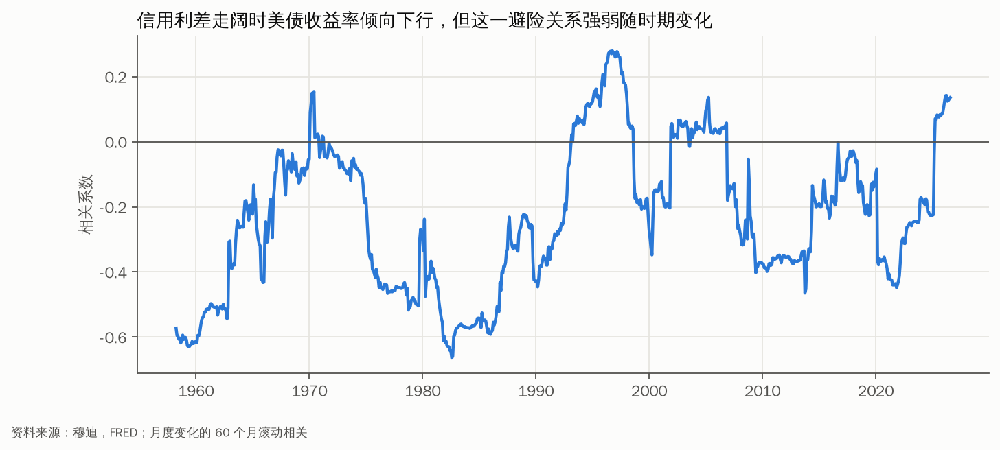

**1953 年以来，10 年期美债收益率月度变化与 Baa−Aaa 信用利差变化的相关系数为 −0.32。** 企业信用恶化时，资金流向美债，压低美债收益率。采用 Baa−Aaa 利差，可避免 Baa−10Y 利差与 10Y 之间的机械负相关。

**避险关系的强度随时期变化，在 1974—1983 年（−0.51 至 −0.57）与 2009—2013 年（−0.37）较强，截至 2026 年 8 月的 60 个月滚动相关转为 0.14。** 近年通胀与财政主导美债定价，信用利差与美债收益率同向波动的时段增多，美债对企业信用风险的对冲作用有所弱化。

## （五）事件研究：超大额发行对 30 年期美债的冲击有限

**图14：超大额企业发债前后，30 年期美债收益率变化多落在正常波动区间内**

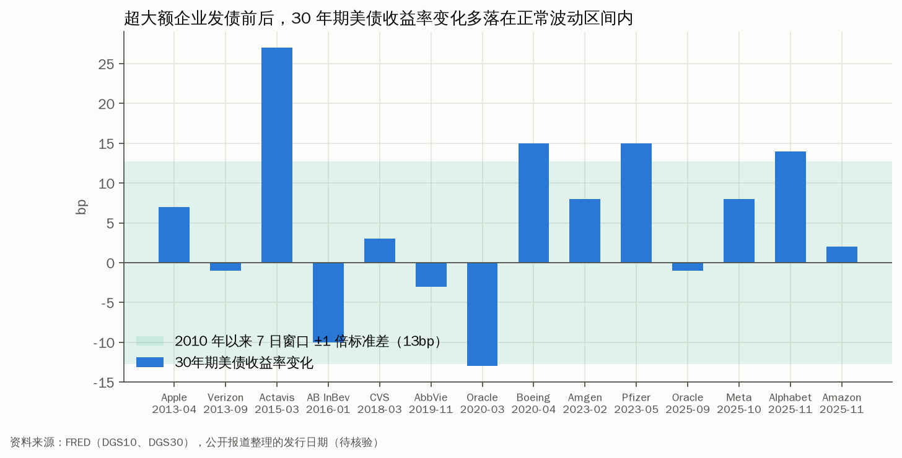

**14 笔单笔 150 亿美元以上的企业发行中，定价日前 3 至后 3 个交易日，30 年期美债收益率平均上行 5.1bp（t=1.49），10 年期平均上行 4.1bp（t=1.15），30Y−10Y 利差平均变化 0.9bp（t=0.70）。** 同期 2010 年以来全部 7 日窗口的 30 年期收益率变化均值为 0.1bp，标准差 12.7bp。方向偏正，但统计上不成立。

**4 笔窗口变化超过 1 倍标准差：Actavis（2015 年 3 月，+27bp）、Boeing（2020 年 4 月，+15bp）、Pfizer（2023 年 5 月，+15bp）、Alphabet（2025 年 11 月，+14bp）。** 这些窗口同时叠加了宏观数据与美联储沟通，难以归因于单笔发行。

**2025 年 9—11 月四笔 AI 相关发行（Oracle、Meta、Alphabet、Amazon）窗口内 30 年期收益率平均上行 5.8bp，3 笔为正。** 与历史大额发行的平均反应接近，AI 发行尚未表现出更强的长端冲击。样本较小，且发行日期来自公开报道整理，需逐笔核验。

# 三、结论与观察清单

**企业部门影响美债利率的五条渠道，历史证据强弱不一：** 一是政策利率渠道，投资增速与联邦基金利率变化的相关系数稳定在 0.5—0.7，证据最强；二是名义增长渠道，名义 GDP 增速与 10 年期美债的相关系数为 0.76—0.83；三是外部融资需求渠道，融资缺口与实际利率同向（0.47）；四是久期供给渠道，季度回归与事件研究均未识别出统计上成立的推升效应，量级或在数个 bp 以内；五是避险渠道，信用利差与美债收益率长期负相关，但近年减弱。

**对当前的判断：** AI 资本开支目前集中在知识产权产品与少数现金充裕的发行人，有形投资占比与企业融资缺口两项总量指标均未显示扩张。本轮美债期限溢价上行的主因或在财政与通胀，企业部门的贡献有限。若有形投资/GDP 回升至 9% 以上、融资缺口转正并扩大至 1% GDP 以上，企业部门对美债利率的推升或由“边际”转为“系统性”。

**未来两个季度，重点观察三点：** 一是 BEA 分项中信息处理设备、数据中心建筑、电力设备投资的增速，判断有形投资是否回升；二是美联储 Z.1 的非金融企业融资缺口，判断企业部门是否转向外部融资；三是超大型科技公司的季度资本开支指引与长久期发行节奏，结合 30 年期美债与 SOFR 互换利差观察发行窗口的定价反应。

**证伪条件：** 若有形投资占比持续回升而 10 年期名义利率与期限溢价同步回落，“有形投资推升名义利率”的历史关系在本轮失效；若超大型科技公司大额发行周内 30 年期互换利差与美债收益率均未出现可识别变化，久期供给渠道的判断需进一步下调。

**风险提示：** AI 资本开支不及预期；美联储降息节奏超预期；信用事件冲击超预期。

# 附录：数据与方法

- 数据：FRED（利率、BEA 投资与 GDP、通胀）；美联储 Z.1 金融账户（S.11.1 非金融企业、F.3.2 美债）；纽约联储 ACM 期限溢价模型、HLW 中性利率估计。季度数据截至 2026Q2，月度截至 2026 年 8 月，日度截至 2026 年 9 月。
- 方法：投资周期以非住宅投资/GDP 四季度均值拐点划分（阈值 0.8 个点）；回归使用 Newey-West 标准误；事件研究窗口为定价日前 3 至后 3 个交易日，发行日期来自公开报道整理，需逐笔核验。
- 复现：`pip install -r requirements.txt && python scripts/fetch_data.py && python scripts/analysis_investment.py && python scripts/analysis_financing.py && python scripts/build_report.py`
- 分项结果：[`06-analysis-investment.md`](06-analysis-investment.md)、[`07-analysis-financing.md`](07-analysis-financing.md)、[`output/`](output/)。
